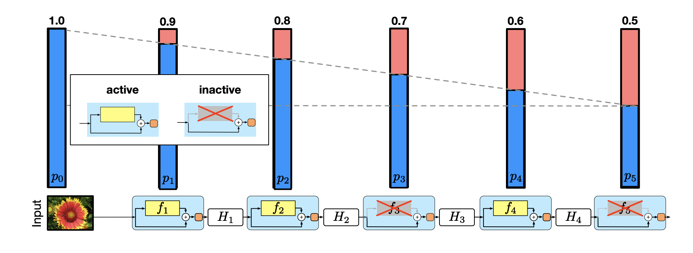
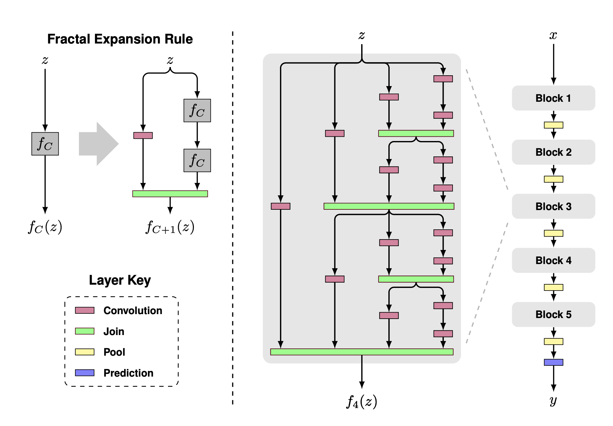
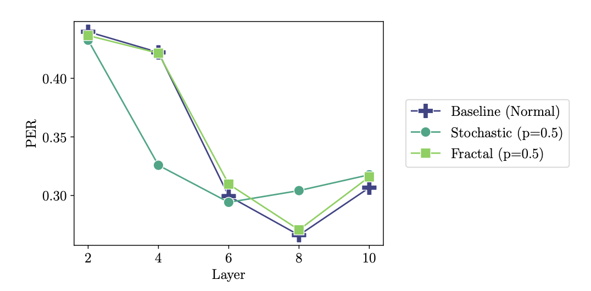

# Dynamic Neural Architectures for Efficient Self-Supervised Speech Representation Learning

This repository contains the codebase and implementation for my BSc thesis project (under [Dr. Hao Tang](https://homepages.inf.ed.ac.uk/htang2/)) on self-supervised speech representation learning, following the Autoregressive Predictive Coding (APC) framework. The code explores how dynamic neural architectures originally proposed for ResNet affect the pretraining dynamics in the speech domain and how useful the learned representations remain for downstream speech tasks such as phone recognition, speaker identification and automatic speech recognition (ASR). In particular, this project explores Stochastic Depth networks ([Huang et al., 2016](https://arxiv.org/abs/1603.09382)) and Fractal Architectures ([Zhang et al., 2020](https://arxiv.org/abs/1605.07648)) on both LSTM and Transformer backbones.

<div align="center">
  <figure>
    
    <figcaption><em>Figure 1: Stochastic Depth Linear Decay as proposed by Huang et al. We use a hyperparameter with a linear decay schedule to preserve earlier layers with higher likelihood</em></figcaption>
  </figure>
  <br/><br/>
  <figure>
    
    <figcaption><em>Figure 2: Fractal Architecture proposed by Zhang et al. The macro-architecture uses convolution (transformer encoders in our work) blocks as units that get joined and pooled together before making a prediction</em></figcaption>
  </figure>
</div>

## 🧠 Architectures Explored
The project features several variations of LSTMs and Transformers to understand the impact of skip connections, stochastic depth and fractal structures on model generalization and training:

- **Baseline UniLSTM:** Standard unidirectional LSTM network. Note our networks need to be unidirectional to prevent information leakage from the future (required for APC training).
- **LSTM with Skip Connections:** Enforces direct residual information flow across layers. We use this as a baseline for the stochastic depth networks since they assume skip connections.
- **Stochastic Depth LSTM:** Applies the Stochastic Depth algorithm which randomly drops layers during training.
- **Fractal LSTM:** Fractal LSTM architecture with multiple branching columns and the drop-path regularization mechanism described in the paper.
- **Transformer Encoder:** Baseline transformer encoder with causal mask to prevent information leakage from the future.
- **Fractal Transformer Encoder:** Transformer encoder augmented with multiple branching columns and the drop-path regularization mechanism described in the paper.

## 🧬 Project Structure
The repository is modularized perfectly for scaling preprocessing, training, and downstream evaluations.

### **Core Scripts**
- `src/train.py`: Pretrains the models using a self-supervised proxy task to predict future Mel features.
- `src/train_probe.py`: Trains a lightweight downstream model (i.e. Phone Probe) over frozen pretrained acoustic features.
- `src/train_phone.py` & `predict_phone.py`: Further downstream evaluation components for phone identification and sequence evaluation.

### **Data Handling**
- `src/data.py` & `src/dataprep.py`: Extensively handles the LibriSpeech Dataset iterations, shuffling, batching, and PyTorch `DataLoader`.
- `src/kaldiark.py`: Parses and reads standard Kaldi `.ark` audio feature configurations.

### **Architecture Designs**
- `src/models/lstm_models.py`: Implementations of UniLSTM, UniLstmSkip, UniLstmStochastic, FractalLSTM, and downstream Probing LSTMs.
- `src/models/transformer_models.py`: Transformer sequence models tailored for APC sequences.

## 🧑‍💻 How to Run
It is advised to set up your dataset properties (Mean/Variance files and scp indices) beforehand. See `train.sh` for an example of configuration passing:
```bash
# Example training loop across epochs
./train.sh path/to/experiment_directory
```
Or running the pipeline individually:
```bash
python src/train.py --config config.json --type "fractal-lstm" --layers 4 --hidden-size 512
```

## 📊 Results

- Both Stochastic Depth and FractalNet architectures significantly reduce pre-training time with **minimal accuracy loss**  
- **Fractal models achieve the best trade-off**, often matching or outperforming baselines  
- Stochastic Depth improves efficiency but is more **sensitive to hyperparameters**
- Downstream performance remains **largely unchanged** despite faster training 

<div align="center">
  <figure>
    
    <figcaption><em>Figure 3: Layer-wise phone-error rates for baseline, stochastic and fractal transformer encoder. We can see that the fractal transformer's performance is practically identical to the baseline, while stochastic depth performs slightly worse when including later layers</em></figcaption>
  </figure>
</div>

<br/>

These results demonstrate that dynamic architectures can make self-supervised speech models more efficient without sacrificing useful representations.

## 📄 Further Details
For full context, empirical data, tables of results, and comprehensive ablation details regarding stochastic approaches, fractal layouts, and training parameters, please refer to the attached `Thesis Report.pdf`.
